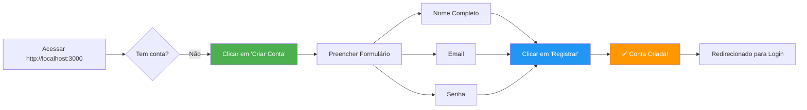
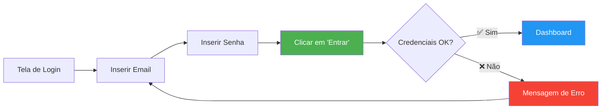
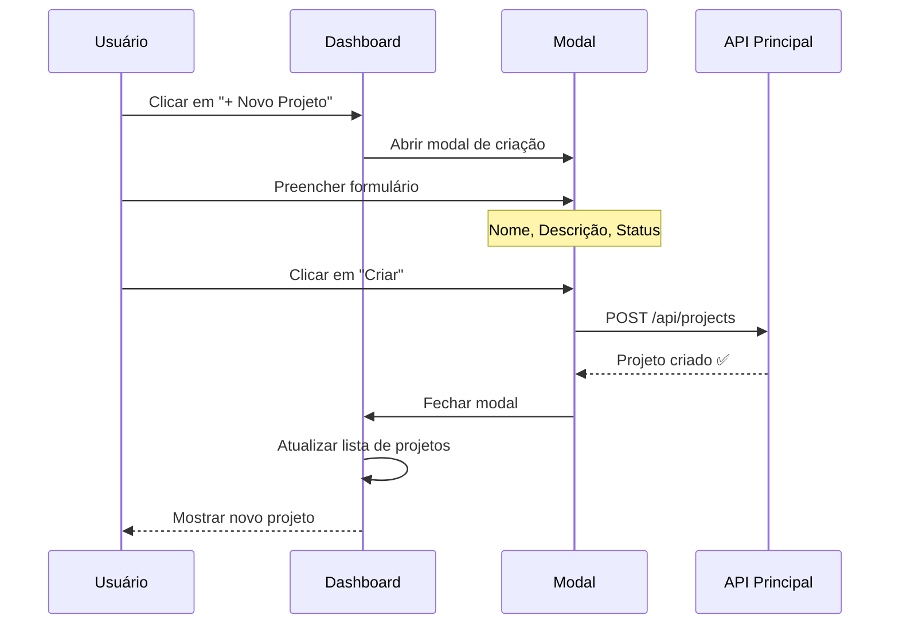
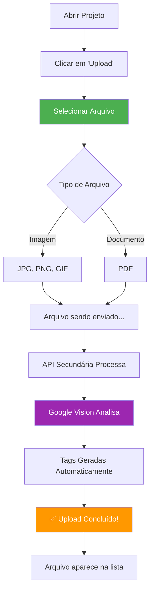
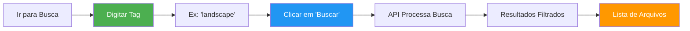
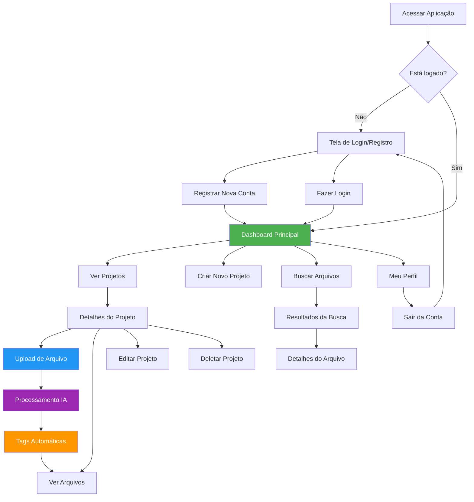

# 🎨 Frontend - Freela Facility

Interface web moderna desenvolvida em **Next.js** com **React** e **TypeScript** para gerenciamento intuitivo de projetos freelance e organização de arquivos.

---

## 📋 Índice

- [Visão Geral](#-visão-geral)
- [Como Usar a Aplicação](#-como-usar-a-aplicação)
- [Tecnologias Utilizadas](#-tecnologias-utilizadas)
- [Estrutura do Projeto](#-estrutura-do-projeto)
- [Instalação e Execução](#-instalação-e-execução)
- [Funcionalidades Principais](#-funcionalidades-principais)
- [Fluxo de Navegação](#-fluxo-de-navegação)

---

## 🎯 Visão Geral

O **Frontend Freela Facility** é uma aplicação web responsiva que permite freelancers gerenciarem seus projetos e arquivos de forma eficiente, com recursos de:

- 🔐 Autenticação segura de usuários
- 📁 Organização de projetos por categorias
- 📤 Upload inteligente de arquivos com análise automática
- 🏷️ Sistema de tags gerado por IA
- 🔍 Busca avançada por tags e conteúdo
- 📊 Dashboard com visão geral dos projetos

---

## 🚀 Como Usar a Aplicação

### 1️⃣ Primeiro Acesso - Registro



**Passo a Passo:**

1. Acesse a aplicação em **http://localhost:3000**
2. Na tela inicial, clique em **"Criar Conta"** ou **"Registrar-se"**
3. Preencha o formulário:
   - **Nome Completo**: Seu nome (ex: João Silva)
   - **Email**: Seu email válido (ex: joao@email.com)
   - **Senha**: Mínimo 6 caracteres
4. Clique em **"Registrar"**
5. Aguarde a confirmação ✅
6. Você será redirecionado para a tela de login

---

### 2️⃣ Login na Aplicação



**Passo a Passo:**

1. Na tela de login, insira seu **email**
2. Insira sua **senha**
3. Clique em **"Entrar"**
4. Você será direcionado ao **Dashboard**

---

### 3️⃣ Dashboard - Visão Geral


O Dashboard é dividido em seções:

| Seção | Descrição | Ações Disponíveis |
|-------|-----------|-------------------|
| **Header** | Barra superior com logo e menu | Logout, Perfil |
| **Sidebar** | Menu lateral de navegação | Projetos, Arquivos, Busca |
| **Cards de Projetos** | Grid com todos os seus projetos | Ver, Editar, Deletar |
| **Botão Novo Projeto** | Ação principal destacada | Criar novo projeto |

---

### 4️⃣ Criar Novo Projeto



**Passo a Passo:**

1. No Dashboard, clique no botão **"+ Novo Projeto"** (geralmente no canto superior direito)
2. Um modal será aberto com o formulário:
   - **Nome do Projeto**: Ex: "Website Cliente X"
   - **Descrição**: Ex: "Desenvolvimento de landing page"
   - **Status**: Selecione entre:
     - 🟡 **Em Andamento**
     - 🟢 **Concluído**
     - 🔴 **Pausado**
3. Clique em **"Criar Projeto"**
4. O projeto aparecerá imediatamente no Dashboard

**Exemplo Visual:**

```
┌─────────────────────────────────────┐
│  Novo Projeto                    ✕  │
├─────────────────────────────────────┤
│                                     │
│  Nome do Projeto:                   │
│  ┌───────────────────────────────┐  │
│  │ Website Cliente X             │  │
│  └───────────────────────────────┘  │
│                                     │
│  Descrição:                         │
│  ┌───────────────────────────────┐  │
│  │ Landing page responsiva       │  │
│  │ com formulário de contato     │  │
│  └───────────────────────────────┘  │
│                                     │
│  Status:                            │
│  ┌───────────────────────────────┐  │
│  │ ▼ Em Andamento                │  │
│  └───────────────────────────────┘  │
│                                     │
│     [Cancelar]  [Criar Projeto]     │
└─────────────────────────────────────┘
```

---

### 5️⃣ Fazer Upload de Arquivos



**Passo a Passo:**

1. Clique em um **projeto** para abri-lo
2. Dentro do projeto, clique em **"📤 Upload de Arquivo"** ou **"Adicionar Arquivo"**
3. Selecione o arquivo do seu computador:
   - **Imagens**: `.jpg`, `.jpeg`, `.png`, `.gif`
   - **Documentos**: `.pdf`
4. Aguarde o processamento (pode levar alguns segundos)
5. O arquivo será analisado automaticamente:
   - 🤖 **Google Cloud Vision** identifica o conteúdo
   - 🏷️ **Tags** são geradas automaticamente
6. O arquivo aparece na lista com suas tags

**Exemplo de Tags Automáticas:**

| Arquivo | Tags Geradas |
|---------|--------------|
| `foto-escritorio.jpg` | `office`, `desk`, `computer`, `workspace` |
| `logo-cliente.png` | `logo`, `brand`, `design`, `graphic` |
| `contrato.pdf` | `document`, `pdf`, `text` |

---

### 6️⃣ Buscar Arquivos por Tags



**Passo a Passo:**

1. No menu lateral, clique em **"🔍 Buscar"** ou **"Pesquisar Arquivos"**
2. Digite uma ou mais tags na barra de busca:
   - Exemplo: `logo`, `landscape`, `document`
3. Clique em **"Buscar"** ou pressione **Enter**
4. A aplicação mostrará todos os arquivos que contêm essas tags
5. Clique em um arquivo para ver detalhes e baixar

**Exemplo de Busca:**

```
┌─────────────────────────────────────────┐
│  🔍 Buscar Arquivos                     │
├─────────────────────────────────────────┤
│                                         │
│  Tags:                                  │
│  ┌─────────────────────────────────┐   │
│  │ landscape, nature            🔍 │   │
│  └─────────────────────────────────┘   │
│                                         │
│  Resultados (3):                        │
│                                         │
│  ┌─────────────────────────────────┐   │
│  │ 📷 mountain-view.jpg            │   │
│  │ Tags: landscape, mountain, sky  │   │
│  │ Confiança: 95%                  │   │
│  └─────────────────────────────────┘   │
│                                         │
│  ┌─────────────────────────────────┐   │
│  │ 📷 forest-path.jpg              │   │
│  │ Tags: nature, forest, path      │   │
│  │ Confiança: 92%                  │   │
│  └─────────────────────────────────┘   │
└─────────────────────────────────────────┘
```

---

### 7️⃣ Gerenciar Projeto

**Ações Disponíveis em Cada Projeto:**

| Ação | Ícone | Descrição |
|------|-------|-----------|
| **Visualizar** | 👁️ | Ver detalhes e arquivos do projeto |
| **Editar** | ✏️ | Alterar nome, descrição ou status |
| **Deletar** | 🗑️ | Remover projeto (confirmação necessária) |

**Editar Projeto:**

1. Passe o mouse sobre o card do projeto
2. Clique no ícone de **✏️ Editar**
3. Modifique os campos desejados
4. Clique em **"Salvar Alterações"**

**Deletar Projeto:**

1. Clique no ícone de **🗑️ Deletar**
2. Confirme a ação no modal de confirmação
3. ⚠️ **Atenção**: Esta ação é irreversível!

---

## 🎨 Fluxo de Navegação Visual



---

## 🛠️ Tecnologias Utilizadas

| Tecnologia | Versão | Finalidade |
|------------|--------|------------|
| **Next.js** | 15.5.7 | Framework React com SSR e otimizações |
| **React** | 19.1.0 | Biblioteca para interfaces de usuário |
| **TypeScript** | 5.x | Tipagem estática para JavaScript |
| **Tailwind CSS** | 4.x | Framework CSS utilitário |
| **Axios** | 1.12.2 | Cliente HTTP para requisições à API |
| **Lucide React** | 0.546.0 | Ícones modernos e customizáveis |

---

## 📁 Estrutura do Projeto

```
frontend-mvp/
├── src/
│   ├── app/
│   │   ├── page.tsx              # Página inicial (Login/Dashboard)
│   │   ├── layout.tsx            # Layout principal
│   │   ├── globals.css           # Estilos globais
│   │   ├── register/
│   │   │   └── page.tsx          # Página de registro
│   │   ├── dashboard/
│   │   │   └── page.tsx          # Dashboard de projetos
│   │   └── projects/
│   │       └── [id]/
│   │           └── page.tsx      # Detalhes do projeto
│   ├── components/
│   │   ├── Header.tsx            # Cabeçalho da aplicação
│   │   ├── Sidebar.tsx           # Menu lateral
│   │   ├── ProjectCard.tsx       # Card de projeto
│   │   ├── FileUpload.tsx        # Componente de upload
│   │   ├── FileList.tsx          # Lista de arquivos
│   │   └── SearchBar.tsx         # Barra de busca
│   └── services/
│       └── api.ts                # Configuração do Axios e endpoints
├── public/
│   └── logo.svg                  # Logo da aplicação
├── Dockerfile
├── package.json
├── tailwind.config.ts
└── tsconfig.json
```

---

## ⚙️ Instalação e Execução

### Com Docker (Recomendado)

```bash
# Na raiz do projeto (api-principal-mvp)
docker-compose up --build

# Acessar aplicação
# http://localhost:3000
```

### Desenvolvimento Local

```bash
cd frontend-mvp

# Instalar dependências
npm install

# Executar em modo desenvolvimento
npm run dev

# Build para produção
npm run build
npm start
```

### Variáveis de Ambiente

Arquivo `.env.local`:

```env
NEXT_PUBLIC_API_URL=http://localhost:8000
```

---

## ✨ Funcionalidades Principais

### 🔐 Autenticação

- **Registro de Usuários**: Formulário com validação
- **Login Seguro**: JWT armazenado em localStorage
- **Proteção de Rotas**: Redirecionamento automático se não autenticado
- **Logout**: Limpeza de sessão

### 📁 Gerenciamento de Projetos

- **Criar Projetos**: Modal intuitivo com formulário
- **Listar Projetos**: Grid responsivo com cards
- **Editar Projetos**: Atualização inline
- **Deletar Projetos**: Confirmação antes de remover
- **Status Visual**: Indicadores coloridos (Em Andamento, Concluído, Pausado)

### 📤 Upload de Arquivos

- **Drag & Drop**: Arraste arquivos para upload
- **Preview**: Visualização antes do envio
- **Progress Bar**: Indicador de progresso
- **Validação**: Tipo e tamanho de arquivo
- **Feedback Visual**: Mensagens de sucesso/erro

### 🏷️ Sistema de Tags

- **Tags Automáticas**: Geradas por IA (Google Vision)
- **Tags Manuais**: Adicionar/remover tags customizadas
- **Badges Coloridos**: Visualização clara das tags
- **Confiança**: Indicador de precisão da IA

### 🔍 Busca Avançada

- **Busca por Tags**: Múltiplas tags simultâneas
- **Filtros**: Por tipo de arquivo, data, projeto
- **Resultados Relevantes**: Ordenados por relevância
- **Preview Rápido**: Visualização sem sair da busca

---

## 🎨 Design e UX

### Paleta de Cores

```css
/* Cores Principais */
--primary: #4CAF50;      /* Verde - Ações principais */
--secondary: #2196F3;    /* Azul - Links e info */
--accent: #FF9800;       /* Laranja - Destaques */
--danger: #f44336;       /* Vermelho - Deletar/Erro */
--success: #4CAF50;      /* Verde - Sucesso */
--warning: #FFC107;      /* Amarelo - Avisos */

/* Neutros */
--background: #f5f5f5;
--surface: #ffffff;
--text-primary: #212121;
--text-secondary: #757575;
```

### Responsividade

| Breakpoint | Largura | Layout |
|------------|---------|--------|
| **Mobile** | < 640px | Stack vertical, menu hambúrguer |
| **Tablet** | 640px - 1024px | Grid 2 colunas |
| **Desktop** | > 1024px | Grid 3-4 colunas, sidebar fixa |

---

## 🔔 Notificações e Feedback

A aplicação fornece feedback visual para todas as ações:

| Ação | Feedback |
|------|----------|
| ✅ **Sucesso** | Toast verde com mensagem |
| ❌ **Erro** | Toast vermelho com detalhes |
| ⏳ **Carregando** | Spinner ou skeleton |
| ⚠️ **Aviso** | Toast amarelo com alerta |

---

## 🧪 Testando a Aplicação

### Fluxo Completo de Teste

1. **Registrar Usuário**
   - Email: `teste@email.com`
   - Senha: `senha123`

2. **Criar Projeto**
   - Nome: "Projeto Teste"
   - Descrição: "Teste de funcionalidades"
   - Status: "Em Andamento"

3. **Upload de Arquivo**
   - Baixe uma imagem de teste
   - Faça upload no projeto criado
   - Aguarde as tags serem geradas

4. **Buscar Arquivo**
   - Use uma das tags geradas
   - Verifique se o arquivo aparece nos resultados

---

## 📱 Capturas de Tela

### Tela de Login
```
┌─────────────────────────────────────┐
│                                     │
│         🏢 Freela Facility          │
│                                     │
│  ┌───────────────────────────────┐  │
│  │ Email                         │  │
│  └───────────────────────────────┘  │
│                                     │
│  ┌───────────────────────────────┐  │
│  │ Senha                    👁️   │  │
│  └───────────────────────────────┘  │
│                                     │
│       [        Entrar        ]      │
│                                     │
│     Não tem conta? Registre-se      │
└─────────────────────────────────────┘
```

### Dashboard
```
┌─────────────────────────────────────────────────────┐
│  🏢 Freela Facility          👤 João Silva    [⚙️]  │
├──────┬──────────────────────────────────────────────┤
│      │                                              │
│  📁  │  Meus Projetos              [+ Novo Projeto]│
│      │                                              │
│  🔍  │  ┌─────────┐  ┌─────────┐  ┌─────────┐     │
│      │  │ Website │  │ Logo    │  │ App     │     │
│  📊  │  │ Cliente │  │ Design  │  │ Mobile  │     │
│      │  │ 🟡      │  │ 🟢      │  │ 🔴      │     │
│  👤  │  └─────────┘  └─────────┘  └─────────┘     │
│      │                                              │
└──────┴──────────────────────────────────────────────┘
```

---

## 🚨 Solução de Problemas

### Erro: "Não foi possível conectar à API"

**Solução:**
1. Verifique se a API Principal está rodando: http://localhost:8000/health
2. Confirme a variável `NEXT_PUBLIC_API_URL` no `.env.local`
3. Verifique logs do Docker: `docker logs freela-api-principal`

### Upload Falha

**Solução:**
1. Verifique o tamanho do arquivo (máx 10MB)
2. Confirme o tipo de arquivo (JPG, PNG, GIF, PDF)
3. Verifique se a API Secundária está rodando: http://localhost:5000/api/files/health

### Tags Não Aparecem

**Solução:**
1. Verifique se o Google Cloud Vision está configurado
2. Consulte logs da API Secundária: `docker logs freela-api-secundaria`
3. Modo fallback: Tags genéricas serão usadas

---

## 🔗 Links Relacionados

- [API Principal - Documentação](../../api-principal-mvp/README.md)
- [API Secundária - Google Cloud Vision](../../api-secundaria-mvp/README.md)

---

## 📄 Licença

Este projeto é parte do MVP Freela Facility.
